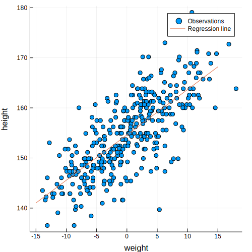
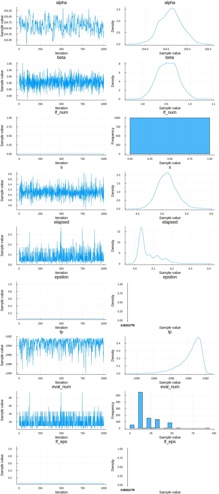

```julia
using TuringModels, MCMCChains
gr(size=(500,500));

Turing.setadbackend(:reverse_diff);
Turing.turnprogress(false);

ProjDir = rel_path_t("..", "scripts", "04")
cd(ProjDir)
```

    loaded


    ┌ Info: [Turing]: global PROGRESS is set as false
    └ @ Turing /Users/rob/.julia/packages/Turing/FTRCE/src/Turing.jl:24


### snippet 4.43


```julia
howell1 = CSV.read(rel_path("..", "data", "Howell1.csv"), delim=';')
df = convert(DataFrame, howell1);
```

Use only adults and center the weight observations


```julia
df2 = filter(row -> row[:age] >= 18, df);
mean_weight = mean(df2[:weight]);
df2[:weight_c] = df2[:weight] .- mean_weight;
first(df2, 5)
```


<table class="data-frame"><thead><tr><th></th><th>height</th><th>weight</th><th>age</th><th>male</th><th>weight_c</th></tr><tr><th></th><th>Float64⍰</th><th>Float64⍰</th><th>Float64⍰</th><th>Int64⍰</th><th>Float64</th></tr></thead><tbody><p>5 rows × 5 columns</p><tr><th>1</th><td>151.765</td><td>47.8256</td><td>63.0</td><td>1</td><td>2.83512</td></tr><tr><th>2</th><td>139.7</td><td>36.4858</td><td>63.0</td><td>0</td><td>-8.50468</td></tr><tr><th>3</th><td>136.525</td><td>31.8648</td><td>65.0</td><td>0</td><td>-13.1256</td></tr><tr><th>4</th><td>156.845</td><td>53.0419</td><td>41.0</td><td>1</td><td>8.05143</td></tr><tr><th>5</th><td>145.415</td><td>41.2769</td><td>51.0</td><td>0</td><td>-3.71361</td></tr></tbody></table>


Extract variables for Turing model


```julia
y = convert(Vector{Float64}, df2[:height]);
x = convert(Vector{Float64}, df2[:weight_c]);
```

Define the regression model


```julia
@model line(y, x) = begin
    #priors
    alpha ~ Normal(178.0, 100.0)
    beta ~ Normal(0.0, 10.0)
    s ~ Uniform(0, 50)

    #model
    mu = alpha .+ beta*x
    for i in 1:length(y)
      y[i] ~ Normal(mu[i], s)
    end
end;
```

Draw the samples


```julia
samples = 2000
adapt_cycles = 1000

@time chn = sample(line(y, x), Turing.NUTS(samples, adapt_cycles, 0.65));
draws = adapt_cycles+1:samples
```

    ┌ Info: [Turing] looking for good initial eps...
    └ @ Turing.Inference /Users/rob/.julia/packages/Turing/FTRCE/src/inference/support/hmc_core.jl:240
    [NUTS{Turing.Core.FluxTrackerAD,Union{}}] found initial ϵ: 0.1
    └ @ Turing.Inference /Users/rob/.julia/packages/Turing/FTRCE/src/inference/support/hmc_core.jl:235
    ┌ Warning: 6.327001291052424 exceeds 5.0; capped to 5.0 for numerical stability
    └ @ Turing.Inference /Users/rob/.julia/packages/Turing/FTRCE/src/inference/adapt/stepsize.jl:96
    ┌ Info:  Adapted ϵ = 0.051517780320521116, std = [1.0, 1.0, 1.0]; 1000 iterations is used for adaption.
    └ @ Turing.Inference /Users/rob/.julia/packages/Turing/FTRCE/src/inference/adapt/adapt.jl:91


    [NUTS] Finished with
      Running time        = 159.94918556499996;
      #lf / sample        = 0.0;
      #evals / sample     = 20.008;
      pre-cond. metric    = [1.0, 1.0, 1.0].
    170.377918 seconds (1.34 G allocations: 87.482 GiB, 15.07% gc time)


    1001:2000


Show corrected results (drop adaptation samples)


```julia
chn2 = MCMCChains.Chains(chn.value[draws,:,:], names=chn.names)
```


    Object of type "Chains{Float64}"
    
    Iterations = 1:1000
    Thinning interval = 1
    Chains = 1
    Samples per chain = 1000
    
    Union{Missing, Float64}[154.565 0.941322 … 22.0 0.0515178; 154.916 0.883904 … 34.0 0.0515178; … ; 154.289 0.851291 … 22.0 0.0515178; 154.37 0.937918 … 10.0 0.0515178]


Look at the proper draws (in corrected chn2)


```julia
describe(chn2)
```

    Iterations = 1:1000
    Thinning interval = 1
    Chains = 1
    Samples per chain = 1000
    
    Empirical Posterior Estimates:
                  Mean                   SD                       Naive SE                      MCSE                ESS    
       alpha   154.61332796  0.259161915144187238180251 0.0081954193462691650451379 0.0210813303088451635403100  151.128487
        beta     0.90576261  0.042698830241467457258242 0.0013502555698791454674712 0.0008073661429612670730610 1000.000000
      lf_num     0.00000000  0.000000000000000000000000 0.0000000000000000000000000 0.0000000000000000000000000         NaN
           s     5.10082014  0.196183320754445472688943 0.0062038613251943043949699 0.0054795928509070619683019 1000.000000
     elapsed     0.07116950  0.054788946285877590525182 0.0017325786086399600719604 0.0025559342065862200761572  459.501100
     epsilon     0.05151778  0.000000000000000013884732 0.0000000000000000004390738 0.0000000000000000023129646   36.036036
          lp -1083.66705962  1.208537476717588265984205 0.0382173106410029217450131 0.0685026818053934005714467  311.246945
    eval_num    18.60400000 13.295862663398866132524745 0.4204520947313308276704902 0.3685864891718090841088440 1000.000000
      lf_eps     0.05151778  0.000000000000000013884732 0.0000000000000000004390738 0.0000000000000000023129646   36.036036
    
    Quantiles:
                   2.5%           25.0%           50.0%           75.0%          97.5%    
       alpha   154.115249976   154.428978890   154.615084568   154.78540763   155.12353252
        beta     0.823492977     0.874431020     0.906152726     0.93672589     0.98784233
      lf_num     0.000000000     0.000000000     0.000000000     0.00000000     0.00000000
           s     4.734281054     4.966697003     5.093838278     5.21369238     5.50648751
     elapsed     0.011072525     0.033625251     0.039526645     0.10545082     0.18928973
     epsilon     0.051517780     0.051517780     0.051517780     0.05151778     0.05151778
          lp -1086.947008681 -1084.227420414 -1083.320255590 -1082.75445198 -1082.31191138
    eval_num     4.000000000    10.000000000    10.000000000    22.00000000    46.00000000
      lf_eps     0.051517780     0.051517780     0.051517780     0.05151778     0.05151778
    


Compare with a previous result


```julia
m4_2s_result = "

Iterations = 1:1000
Thinning interval = 1
Chains = 1,2,3,4
Samples per chain = 1000

Empirical Posterior Estimates:
         Mean        SD       Naive SE       MCSE      ESS
alpha 154.597086 0.27326431 0.0043206882 0.0036304132 1000
 beta   0.906380 0.04143488 0.0006551430 0.0006994720 1000
sigma   5.106643 0.19345409 0.0030587777 0.0032035103 1000

Quantiles:
          2.5%       25.0%       50.0%       75.0%       97.5%
alpha 154.0610000 154.4150000 154.5980000 154.7812500 155.1260000
 beta   0.8255494   0.8790695   0.9057435   0.9336445   0.9882981
sigma   4.7524368   4.9683400   5.0994450   5.2353100   5.5090128
";
```

Plot the regerssion line and observations


```julia
scatter(x, y, lab="Observations", xlab="weight", ylab="height")
xi = -15.0:0.1:15.0
yi = mean(chn2.value[:,1,:]) .+ mean(chn2.value[:, 2, :])*xi
plot!(xi, yi, lab="Regression line")
```





Plot the chains


```julia
plot(chn2)
```

    ┌ Warning: No strict ticks found
    └ @ PlotUtils /Users/rob/.julia/packages/PlotUtils/GxT73/src/ticks.jl:173
    ┌ Warning: No strict ticks found
    └ @ PlotUtils /Users/rob/.julia/packages/PlotUtils/GxT73/src/ticks.jl:173





    ┌ Warning: No strict ticks found
    └ @ PlotUtils /Users/rob/.julia/packages/PlotUtils/GxT73/src/ticks.jl:173
    GKS: Rectangle definition is invalid in routine SET_WINDOW
    GKS: Rectangle definition is invalid in routine SET_WINDOW
    ┌ Warning: No strict ticks found
    └ @ PlotUtils /Users/rob/.julia/packages/PlotUtils/GxT73/src/ticks.jl:173
    GKS: Rectangle definition is invalid in routine SET_WINDOW
    GKS: Rectangle definition is invalid in routine SET_WINDOW
    ┌ Warning: No strict ticks found
    └ @ PlotUtils /Users/rob/.julia/packages/PlotUtils/GxT73/src/ticks.jl:173
    GKS: Rectangle definition is invalid in routine SET_WINDOW
    GKS: Rectangle definition is invalid in routine SET_WINDOW
    ┌ Warning: No strict ticks found
    └ @ PlotUtils /Users/rob/.julia/packages/PlotUtils/GxT73/src/ticks.jl:173
    GKS: Rectangle definition is invalid in routine SET_WINDOW
    GKS: Rectangle definition is invalid in routine SET_WINDOW


End of `m4.2t.jl`

*This notebook was generated using [Literate.jl](https://github.com/fredrikekre/Literate.jl).*
